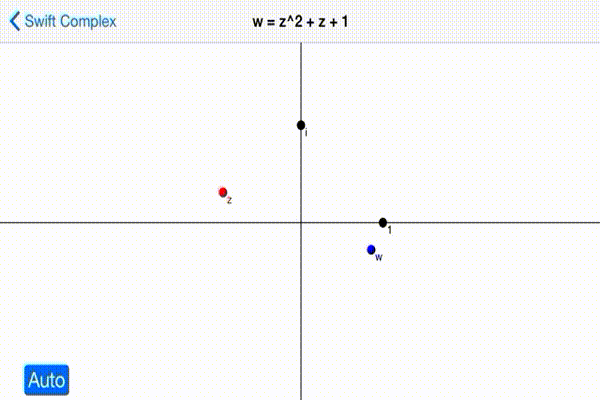

SwiftComplex
============



A simple project that shows you how to create *Complex Numbers* and *Complex Planes* using Swift.

# Complex

```swift
let z =  3 + 2 * i
let w = -2 - i
z + w ==  1 + i
z * w == -4 - 7 * i
```

You can also create a Complex with polar form.

```swift
let z = Complex(r: 2, θ: M_PI / 4)
abs(z) == 2
arg(z) == M_PI / 4
```

[Check out the code](./SwiftComplex/Complex.swift) and see how simple they are implemented!

# ComplexPlane


```
let cplane = ComplexPlane(frame: …)
cplane.scale = 2.0

cplane["1"] = (1, nil)
cplane["i"] = (i, nil)

let z = Complex(r: 2, θ: M_PI / 3)
cplane["z"] = (z, UIColor.redColor())

let w = z * z
cplane["w"] = (w, UIColor.blueColor())
```

# Copyright and license

copyright 2014 Taketo Sano. Code released under the [MIT license](LICENSE.md).
