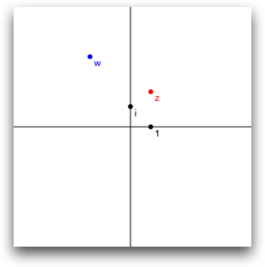

SwiftComplex
============


*Interact with Complex Numbers!* This is a simple project which you can visually understand how complex multiplication works.

# Complex

```swift
let z =  3 + 2 * i
let w = -2 - i
z + w ==  1 + i
z * w == -4 - 7 * i
```

Also supports polar form.

```swift
let z = Complex(r: 2, θ: M_PI / 4)
abs(z) == 2
arg(z) == M_PI / 4
```

[Check out the code](./SwiftComplex/Complex.swift) and see how simple they are implemented!

# ComplexPlane



```
let cplane = ComplexPlane(frame: …)
cplane["1"] = Complex(1)
cplane["i"] = i

let z = Complex(r: 2, θ: M_PI / 3)
cplane["z"] = z
cplane.colors["z"] = UIColor.redColor()

let w = z * z
cplane["w"] = w
cplane.colors["w"] = UIColor.blueColor()
```

[Here's the code](./SwiftComplex/ComplexPlane.swift).

# Copyright and license

copyright 2014 Taketo Sano. Code released under the [MIT license](LICENSE.md).
